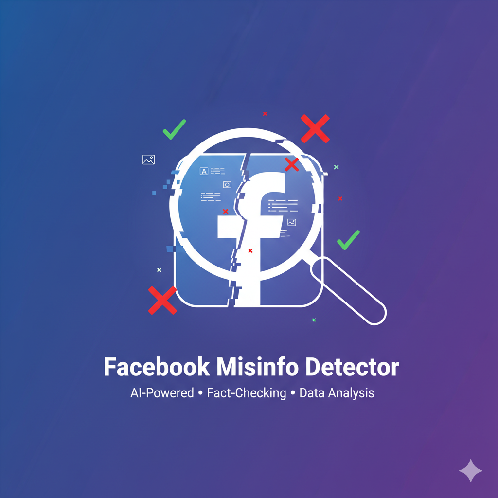

# Hi there, I'm Ahmed Sief El-Eslam 👋
### Intelligent Systems Engineer | AI & Machine Learning Enthusiast

  
  
  

 

I am a motivated engineering student at Helwan National University with a strong foundation in software development, AI, embedded systems, and networking. I am passionate about building intelligent solutions, from DeepFake detection models and autonomous driving simulations to full-stack cloud automation and robust IoT systems.

## 📊 GitHub Analytics

 

## 🚀 Featured Projects

<table align="center">
  <tr>
    <td align="center" width="33%">
      <a href="https://github.com/ahmedsief0/Deep-Fake-Detection-">
        
          
        <b>🕵️ DeepFake Detection System</b>
      </a>
       
      Award-winning Computer Vision model (DEPI x eYouth).
    </td>
    <td align="center" width="33%">
      <a href="https://github.com/ahmedsief0/Facebook-MissInfo-Detector">
        
          
        <b>Miss Info Detection</b>
      </a>
       
      Facebook Miss info detection Tool
    </td>
    <td align="center" width="33%">
      <a href="https://github.com/ahmedsief0/Smart-Entrance-Gate">
        
          
        <b>📸 Smart-Entrance-Gate</b>
      </a>
       
      Real-time face recognition & logging.
    </td>
  </tr>
</table>

 

## 🛠️ Skills & Technologies
- **Programming Languages:** Python, C, C++, Java
- **Machine Learning & AI:** CNN, RNN, Reinforcement Learning (PPO, DQN), KNN, SVM, NLP, LLMs, Computer Vision, OCR
- **Software Development:** OOP, Data Structures & Algorithms, APIs (Flask, FastAPI), Full-Stack Web Apps
- **Embedded Systems & Hardware:** Arduino, Microcontrollers, Raspberry Pi, Bare-metal register drivers, Biometric sensors
- **Networking & Cloud:** TCP/IP, Azure, VPS Handling, n8n Automation, Cisco Packet Tracer, SDN Solutions (POX, Mininet)
- **Tools & OS:** Linux, Windows, Proteus, MATLAB, LabVIEW, CARLA Simulator

## 🏆 Achievements & Leadership
- **3rd Place - Machine Learning Track:** DEPI x eYouth Competition for the DeepFake Detection Model.
- **Team Leadership:** Led a team to develop a smart, temperature-controlled fan system using PWM and microcontrollers, receiving university recognition.
- **Freelance Developer:** Highly rated on Freelancer.com & Mostaqel.com, delivering custom software and automation solutions.

## 🎓 Education & Certifications
- **Intelligent Systems Engineering:** Helwan National University (Expected Jan 2027)
- **HCIP-AI** (Huawei / Cairo University)
- **Oracle Cloud Infrastructure 2025:** AI Foundations Associate
- **NVIDIA:** Deep Learning Fundamentals

---

  <i>Always eager to collaborate, learn, and contribute to impactful tech projects!</i>

"""

